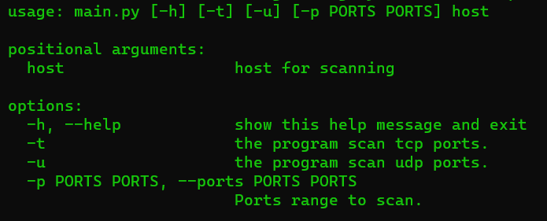
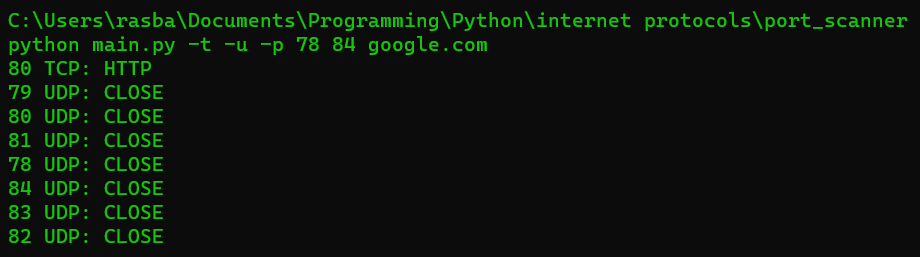
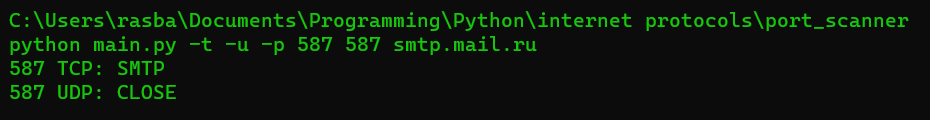

# TCP-UDP_scanner
Сканер TCP-UDP - консольная утилита, разработанная для сканирования TCP и UDP портов на хосте. Утилита способна определить протокол, который работает на открытом порту, такие как HTTP, SMTP, POP3, SNTP и другие.
Принцип работы TCP-UDP сканера основан на итеративном сканировании портов на удаленном хосте с целью определения открытых портов и протоколов, используемых на этих портах.

## Принцип работы
Сканер TCP-UDP использует сокеты для установления соединений с портами на указанном хосте и проверки их доступности. Для сканирования TCP портов применяется подход с установлением соединения, а для сканирования UDP портов используется отправка и прием пакетов данных.

Эта утилита позволяет сканировать заданный диапазон портов на указанном хосте и выводить информацию о доступности портов и определенном на них протоколе.

Благодаря параллельной обработке, сканер TCP-UDP обеспечивает эффективное сканирование портов и быструю выдачу результатов сканирования.

## Применение

Для получения справки используйте -h или --help:

``python main.py -h``

### Справка:

## Пример работы

